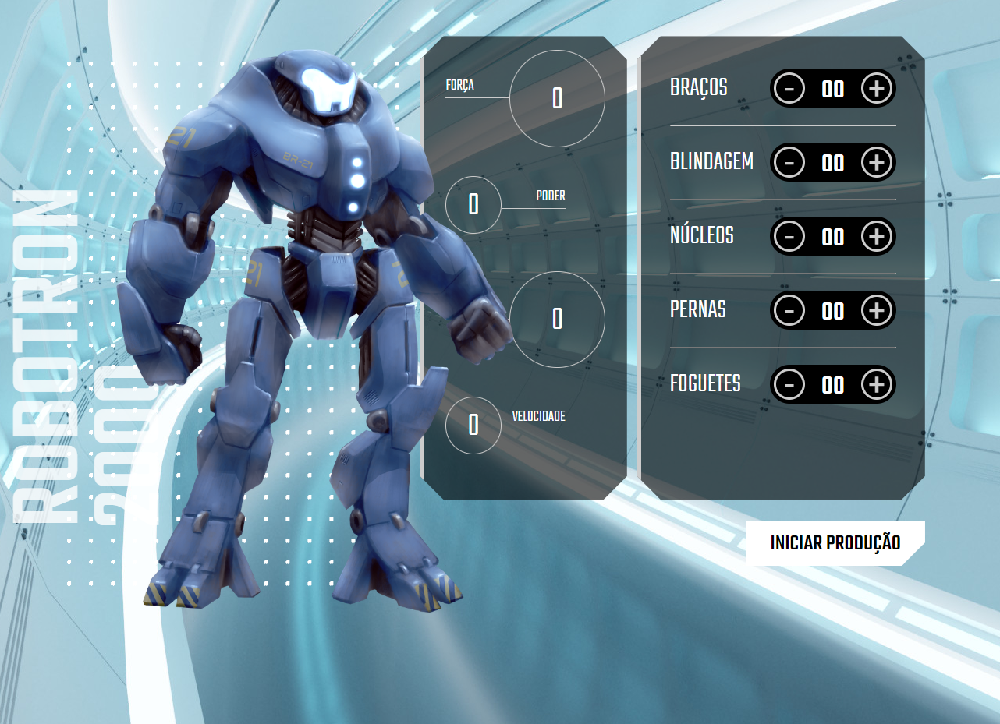

<h1 align="center"> Robotron 2000 </h1>

  

## 🚀 Tecnologias

Esse projeto foi desenvolvido com as seguintes tecnologias:

- HTML, CSS e JAVASCRIPT
- Git e Github

## 💻 Projeto

O Robotron é um projeto dinâmico feito na formação da Alura visando praticar lógica de JavaScript e sua dinâmica.

- [Acesse o projeto finalizado, online](https://ramonwordads.github.io/robotron2000)
